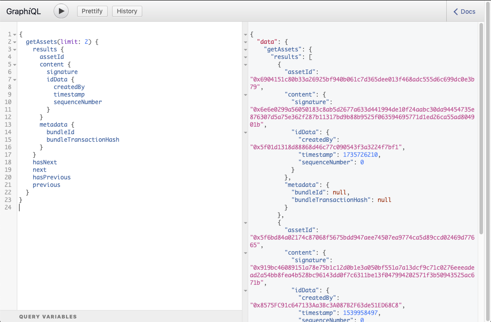

# Hermes Extended API   

Additional querying capabilities which consists of both REST and GraphQL APIs.


## Getting Started

Install dependencies
```
npm install
```

Run development
```
npm start
```

The extended API should now be running on port 3000


## Testing

Run tests
```
npm run dev:test
```

Run linting
```
npm run dev:lint
```

## Production

Build
```
npm run build
```

Run compiled server code
```
npm run start:server
```

Clean build
```
npm dev:clean
```

## Usage (REST)

GET endpoints exist for basic fetching of various data collections including assets, events and bundles. 

#### Examples:

Get asset
```
curl -X GET http://localhost:3000/api/asset/<assetId>
```
Get assets
```
curl -X GET http://localhost:3000/api/asset 
```

Get event
```
curl -X GET http://localhost:3000/api/event/<eventId>
```

Get events
```
curl -X GET http://localhost:3000/api/event 
```

Get bundle
```
curl -X GET http://localhost:3000/api/bundle/<bundleId>

```
Get bundles
```
curl -X GET http://localhost:3000/api/bundle 
```

### Pagination

Result sets contain next and previous object pointers which allow navigation through the result set. To navigate to the next page send either pointers and the result set will begin from that position. If both pointers are sent, the next pointer will take precendence. 'hasNext' and 'hasPrevious' indicate whether or not there is additional data in either direction.

#### Example
```
{
    "results": [
        ...
    ]
    "previous": "WzE1Mzk5NjM3ODIseyIkdW5kZWZpbmVkIjp0cnVlfV0",
    "hasPrevious": false,
    "next": "WzE1Mzk5NTU0MTkseyIkdW5kZWZpbmVkIjp0cnVlfV0",
    "hasNext": true
}
```

### Filtering data

Querying (filtering) can be achieved by sending a POST request containing a valid query object. 

#### The query object has the following format:

```
{
    "query": [{
		"field": "",
		"value": "",
		"operator": ""
	},
    ],
    "limit": 0,
    "previous": ""
    "next": ""
    }
```

#### Explanation:

The **field** key corresponds to a field in the database and can be targeted using dot notation. For example 'metadata.bundleId' and 'content.data.unit'. 

The **value** key is used to filter the supplied field and can contain an array, dict or primitive.

The **operator** key specifies how the field should be queried against the value. 


#### The following operators are supported: 

| Operator | Expected value |
| --- | --- |
| equal | String or Array |
| not-equal | String or Array |
| greater-than | Integer |
| greater-than-equal | Integer |
| less-than | Integer |
| less-than-equal | Integer |
| inrange | Dictionary containing range - see below |

The inrange operator expects a value in the following format:
```
{
    "field": "content.idData.timestamp",
    "value": {"greater-than-equal": 1538315311, "less-than-equal": 1540216111},
    "operator": "inrange"
}
```

### Query Examples:

Querying an event of type, created gte to a timestamp
```
curl -X POST http://localhost:3000/api/event/query \
  -H 'Content-Type: application/json' \
  -d '{
	"query": [{
		"field": "content.data.type",
		"value": "ambrosus.asset.info",
		"operator": "equal"
	},
	{
		"field": "content.idData.timestamp",
		"value": 1535723311,
		"operator": "greater-than-equal"
	}]
}
```

Querying events not of a type, for a list of assets
```
curl -X POST http://localhost:3000/api/event/query \
  -H 'Content-Type: application/json' \
  -d '{
	"query": [{
		"field": "content.data.type",
		"value": [
			"ambrosus.asset.info", "ambrosus.asset.branding"
			],
		"operator": "not-equal"
	},
	{
		"field": "content.idData.assetId",
		"value": [
			"0x7dca2776fad2ee828b2fbc5d51951b1a8d95d8fa83593e692e95dfed084c5691", "0xf0e2333a01d75a71a6e944a602b11d8f2399c2f57070be3131a869cb0b5e1d97"
			],
		"operator": "equal"
	}]
}
```

Querying events for assets not created by a user
```
curl -X POST http://localhost:3000/api/event/query \
  -H 'Content-Type: application/json' \
  -d '{
	"query": [{
		"field": "content.idData.assetId",
		"value": [
			"0x7dca2776fad2ee828b2fbc5d51951b1a8d95d8fa83593e692e95dfed084c5691", "0xf0e2333a01d75a71a6e944a602b11d8f2399c2f57070be3131a869cb0b5e1d97"
			],
		"operator": "equal"
	},
	{
		"field": "content.idData.createdBy",
		"value": "0x38E80315167c5367A56993A6accB58c81B3A81df",
		"operator": "not-equal"
	}]
}
```

### Aggregation

A special endpoint exists to perform limited aggregation of events grouped by assetId. The endpoint exists to fetch the latest asset event of a certain type.

#### Examples:

```
curl -X POST http://localhost:3000/api/event/latest/type \
  -H 'Content-Type: application/json' \
  -d '{
	"assets": ["0x9d8c8bb6101751b583e64002ad8abe681aa61b6f8179ccef668fce91798e3018", "0x2be15879ad66636da6a5cccc70d75cda65809113f50355d97c93296d67486913"],
	"type": "ambrosus.asset.info"
}
```

### Analytics

The following summations are available for all data collections. Time serious data is TBD

#### Examples:

Count all events
```
curl -X GET  http://localhost:3000/api/event/count 
```

Count of events created month to date
```
curl -X GET  http://localhost:3000/api/event/mtd
```

Count of events created on a sepcific date
```
curl -X GET  http://localhost:3000/api/event/count/date/20181001
```

Count of events created within a date range
```
curl -X GET  http://localhost:3000/api/event/count/daterange/20180901/20181031
```

Count of events created from now to a number of hours back
```
curl -X GET  http://localhost:3000/api/event/count/rolling/hours/10
```

Count of events created from now to a number of days back
```
curl -X GET  http://localhost:3000/api/event/count/rolling/days/10
```

## Usage (GraphQL)



In browser IDE:

```
http://localhost:3000/api/graphiql
```

GraphQL Endpoint:

```
http://localhost:3000/api/gql
```

Angular support:

https://www.apollographql.com/docs/angular/


#### Examples:

Get events
```
curl -X POST http://localhost:3000/gql \
  -H 'Content-Type: application/json' \
  -d '{
    "query": "{
		getEvents {
			results {
				eventId
				content {
					signature
					idData {
						assetId
						createdBy
						accessLevel
						timestamp
					} 
				}
			}
			hasNext
			next
			hasPrevious
			previous
		}
	}",
    "variables": null,
    "operationName": null
}'

```

Get events, limiting results
```
curl -X POST http://localhost:3000/gql \
  -H 'Content-Type: application/json' \
  -d '{
    "query": "{
		getEvents {
			results {
				eventId
				content {
					idData {
						assetId
					} 
				}
			}
			hasNext
			next
		}
	}",
    "variables": null,
    "operationName": null
}'

```